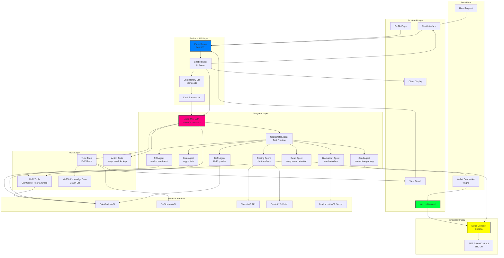
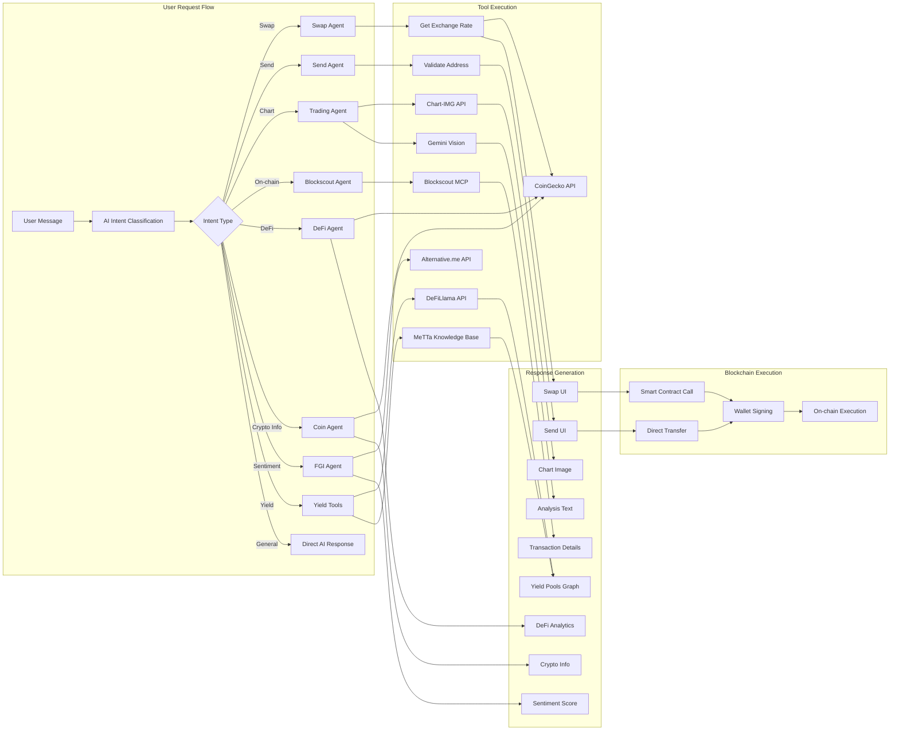
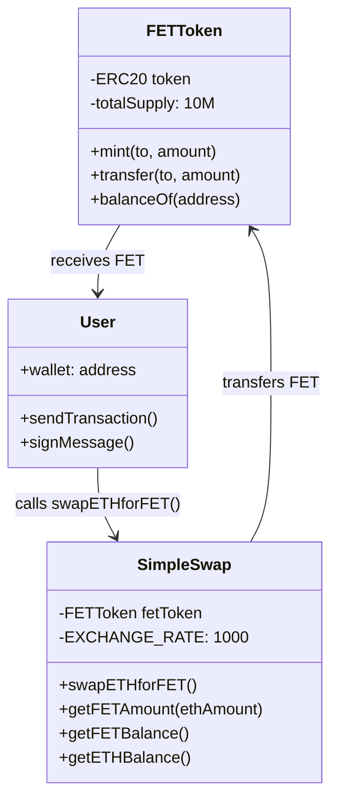
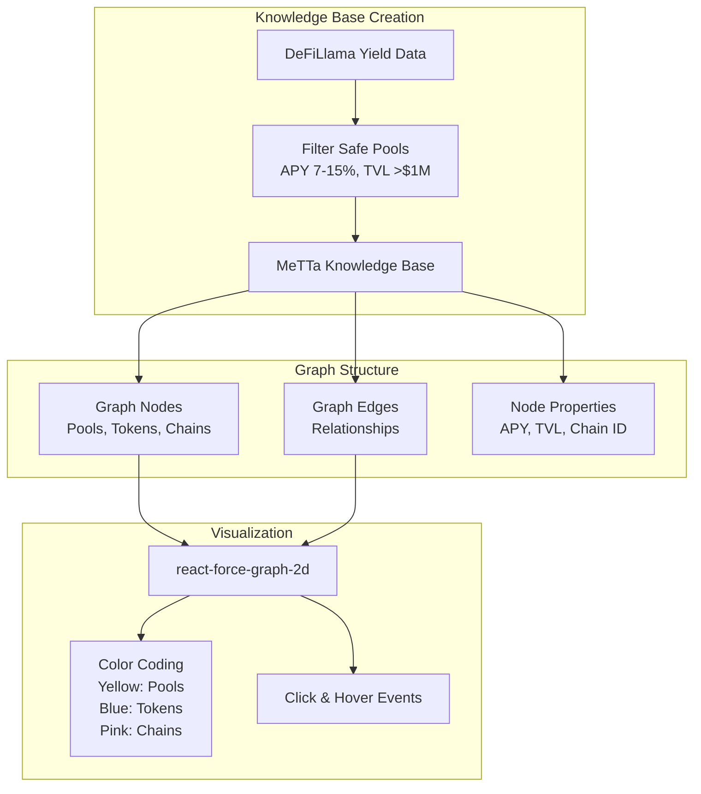
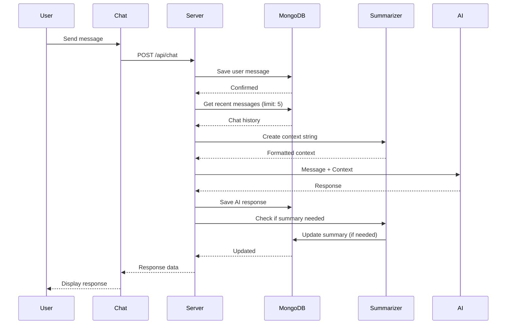

# Superio AI - Architecture Documentation

## System Overview

Superio AI is an AI-powered DeFi intelligence platform that combines multiple AI agents, blockchain integrations, and real-time data sources to provide intelligent DeFi interactions.

## Architecture Diagram



## Agent Processing Flow

```mermaid
sequenceDiagram
    participant User
    participant Chat
    participant Server
    participant AI
    participant Agent
    participant Tools
    participant Contract
    participant External

    User->>Chat: "swap 0.001 eth to fet"
    Chat->>Server: POST /api/chat
    
    Server->>AI: Analyze intent with context
    AI->>AI: Function call decision
    AI->>Server: swap_token({
        from_token: "ETH",
        to_token: "FET",
        from_amount: 0.001
    })
    
    Server->>Agent: SwapAgent.parse()
    Agent->>Tools: Get exchange rate (ETH→FET)
    Tools->>External: CoinGecko API
    External-->>Tools: Rate: 1 ETH = 1000 FET
    Tools-->>Agent: Rate data
    
    Agent->>Agent: Calculate swap details
    Agent-->>Server: Swap UI data
    
    Server-->>Chat: Swap transaction ready
    Chat->>User: Display swap UI
    
    User->>Chat: Click "Swap" button
    Chat->>Contract: writeContract(swapETHforFET)
    Contract->>User: Wallet popup
    User->>Wallet: Sign transaction
    Wallet->>Contract: Execute swap
    Contract-->>Chat: Transaction hash
    Chat-->>User: Success confirmation
```

## Agent Details

### 1. Swap Agent
**Purpose**: Parse swap intents and generate swap UIs

**Input**: User message (e.g., "swap 0.001 eth to fet")
**Process**:
1. Detect swap keywords
2. Extract token pairs and amounts
3. Fetch real-time exchange rates
4. Calculate output amounts
5. Generate swap UI data

**Output**: Swap UI with transaction details

---

### 2. Send Agent
**Purpose**: Parse send/transfer intents

**Input**: User message (e.g., "send 0.1 eth to 0x...")
**Process**:
1. Detect send keywords
2. Extract recipient address
3. Extract amount
4. Generate send UI

**Output**: Send transaction UI

---

### 3. Trading Agent
**Purpose**: Analyze cryptocurrency charts

**Input**: Symbol, exchange, interval
**Process**:
1. Fetch chart image from Chart-IMG API
2. Analyze with Gemini 2.5 Vision
3. Generate BUY/SELL/HOLD recommendation
4. Provide technical analysis

**Output**: Chart image + analysis + recommendation

---

### 4. Blockscout Agent
**Purpose**: Query on-chain blockchain data

**Input**: Transaction hash or address
**Process**:
1. Query Blockscout MCP Server
2. Parse transaction/address data
3. Calculate reputation metrics
4. Generate on-chain analytics

**Output**: Transaction details or address analytics

---

### 5. Coordinator Agent
**Purpose**: Route tasks to appropriate specialized agents

**Input**: User intent classification
**Process**:
1. Analyze request type
2. Determine required data sources
3. Dispatch to appropriate agents
4. Aggregate responses
5. Return unified result

**Output**: Coordinated multi-agent response

---

### 6. DeFi Agent
**Purpose**: Handle DeFi-specific queries

**Input**: DeFi-related questions
**Process**:
1. Query DeFi data from CoinGecko
2. Analyze yield farming opportunities
3. Provide liquidity pool information
4. Calculate APY and risks

**Output**: DeFi analytics and recommendations

---

### 7. Coin Agent
**Purpose**: Provide cryptocurrency information

**Input**: Coin name or symbol
**Process**:
1. Fetch coin data from CoinGecko
2. Get price, market cap, volume
3. Analyze price trends
4. Provide market insights

**Output**: Cryptocurrency information and market data

---

### 8. FGI Agent (Fear & Greed Index)
**Purpose**: Analyze market sentiment

**Input**: General market queries
**Process**:
1. Fetch Fear & Greed Index
2. Calculate sentiment score
3. Correlate with market trends
4. Provide sentiment analysis

**Output**: Market sentiment indicators and analysis

---

## Data Flow Architecture



## Smart Contract Architecture



## Knowledge Graph Architecture (MeTTa)



## Chat History & Context Flow



## Technology Stack

### Frontend
- **Framework**: Next.js 14 (App Router)
- **UI Library**: React, Tailwind CSS
- **Blockchain**: wagmi, viem
- **Charts**: react-force-graph-2d
- **State**: React Hooks

### Backend
- **API Server**: Flask (Python)
- **AI**: ASI1-Mini LLM
- **Database**: MongoDB
- **Image Analysis**: Google Gemini 2.5
- **Blockchain**: Blockscout MCP Server

### Smart Contracts
- **Language**: Solidity 0.8.20
- **Framework**: Hardhat
- **Network**: Ethereum Sepolia
- **Libraries**: OpenZeppelin 5.0

### External APIs
- **Crypto Data**: CoinGecko
- **DeFi Data**: DeFiLlama
- **Charts**: Chart-IMG
- **Blockchain**: Blockscout

## API Endpoints

### Chat & Messaging
- `POST /api/chat` - Main chat endpoint
- `GET /api/chat/history?wallet_address=<addr>` - Get chat history
- `POST /api/chat/message` - Add message
- `PUT /api/chat/summary` - Update summary

### Data & Visualization
- `GET /api/yield/metta` - Get MeTTa knowledge graph
- `GET /api/chart/<filename>` - Serve chart images

### Health & Status
- `GET /api/health` - Health check
- `GET /api/asi-health` - ASI API status

## Security Features

1. **CSP (Content Security Policy)** - Restricts resource loading
2. **CORS Configuration** - Controlled cross-origin requests
3. **Input Validation** - All user inputs sanitized
4. **Reentrancy Protection** - Smart contract guard
5. **Rate Limiting** - API protection (ready for implementation)

## Deployment

- **Frontend**: Vercel (Automatic deployment)
- **Backend**: Heroku (Flask server)
- **Database**: MongoDB Atlas (Cloud)
- **Contracts**: Sepolia Testnet (Hardhat)

## Future Enhancements

1. **Multi-chain Support** - Add Polygon, Base, Arbitrum
2. **Advanced Trading** - Limit orders, stop-loss
3. **Portfolio Tracking** - Multi-wallet aggregation
4. **Social Features** - Share trades, leaderboards
5. **Mobile App** - React Native implementation
