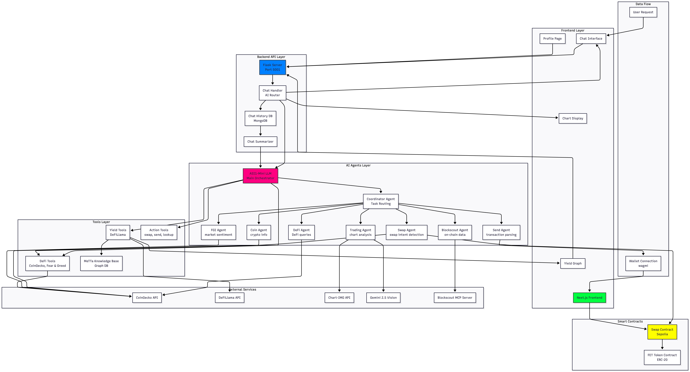

# 🔮 Superio AI

> **AI-Powered DeFi Intelligence Platform** - Your intelligent assistant for decentralized finance, on-chain analytics, and smart contract interactions.

[](https://opensource.org/licenses/MIT)
[](https://nextjs.org/)
[](https://www.python.org/)
[](https://flask.palletsprojects.com/)

---

## 📖 Overview

Superio AI is an advanced AI-powered platform that combines multiple AI agents, blockchain integrations, and real-time data sources to provide intelligent DeFi interactions. It enables users to swap tokens, analyze charts, query on-chain data, discover yield opportunities, and interact with smart contracts through natural language conversation.

### ✨ Key Features

- 🤖 **Multi-Agent AI System** - Coordinated AI agents for specialized tasks
- 💬 **Natural Language Interface** - Chat with AI to execute DeFi actions
- 📊 **Chart Analysis** - AI-powered technical analysis with Gemini Vision
- 🔍 **On-Chain Analytics** - Comprehensive blockchain data queries
- 💰 **Token Swaps** - Seamless swap transactions via smart contracts
- 📈 **Yield Discovery** - Find and analyze DeFi yield opportunities
- 🌐 **Knowledge Graph** - Interactive MeTTa-based DeFi visualization
- 💾 **Chat History** - Persistent conversation context with MongoDB

---

## 🏗️ Architecture



### System Components

#### Frontend Layer
- **Next.js 14** - React-based web application
- **Chat Interface** - Conversational AI interface
- **Yield Graph** - Interactive MeTTa knowledge graph visualization
- **Profile Page** - User account and settings
- **Wallet Integration** - Web3 wallet connection (wagmi)

#### Backend API Layer
- **Flask Server** - RESTful API (Port 5001)
- **Chat Handler** - AI-powered request router
- **Chat History DB** - MongoDB for conversation storage
- **Chat Summarizer** - Context-aware conversation management

#### AI Agents Layer
- **ASI1-Mini LLM** - Main AI orchestrator
- **Coordinator Agent** - Task routing and coordination
- **Swap Agent** - Token swap intent detection
- **Send Agent** - Transaction parsing and preparation
- **Trading Agent** - Chart analysis with vision AI
- **Blockscout Agent** - On-chain data queries
- **DeFi Agent** - DeFi protocol queries
- **Coin Agent** - Cryptocurrency information
- **FGI Agent** - Fear & Greed Index sentiment

#### Tools Layer
- **DeFi Tools** - CoinGecko, Fear & Greed Index integration
- **Yield Tools** - DeFiLlama integration for yield data
- **Action Tools** - Swap, send, lookup functionality
- **MeTTa Knowledge Base** - Graph database for DeFi knowledge

#### Smart Contracts
- **Swap Contract** - Token swap smart contract (Sepolia)
- **FET Token** - ERC-20 token contract

---

## 🚀 Quick Start

### Prerequisites

- **Node.js** 18+ and npm/yarn
- **Python** 3.10+
- **MongoDB** (local or Atlas)
- **Web3 Wallet** (MetaMask, WalletConnect, etc.)
- **Environment Variables** (see Setup section)

### Frontend Setup

```bash
# Install dependencies
npm install

# Start development server
npm run dev

# Open http://localhost:3000
```

### Backend Setup

```bash
# Navigate to server directory
cd server

# Create virtual environment
python -m venv venv

# Activate virtual environment
# On macOS/Linux:
source venv/bin/activate
# On Windows:
venv\Scripts\activate

# Install Python dependencies
pip install -r requirements.txt

# Set up environment variables
cp .env.example .env
# Edit .env with your API keys

# Start Flask server
python api/server.py
```

### Environment Variables

Create a `.env` file in the `server/` directory:

```env
# ASI AI API Key
ASI_API_KEY=your_asi_api_key_here

# MongoDB Connection
MONGODBURI=mongodb://localhost:27017/superio

# Chart-IMG API (optional, for live charts)
CHART_IMG_API_KEY=your_chart_img_api_key_here

# Gemini API (for chart analysis)
GOOGLE_API_KEY=your_google_api_key_here

# Blockscout MCP Server
BLOCKSCOUT_MCP_URL=https://mcp.blockscout.com/mcp

# Frontend URL (for CORS)
FRONTEND_URL=http://localhost:3000

# API URL (for serving charts)
API_URL=http://localhost:5001
```

---

## 📚 Documentation

- **[Architecture Documentation](./ARCHITECTURE.md)** - Complete system architecture
- **[Server README](./server/README.md)** - Backend setup and API documentation
- **[Quick Start Guide](./server/QUICKSTART.md)** - Server quick start
- **[Components Documentation](./docs/components.md)** - React component documentation
- **[Notifications Guide](./docs/notifications.md)** - Notification system
- **[Reminders Guide](./docs/reminders.md)** - Reminder functionality

---

## 🎯 Features in Detail

### 1. Natural Language Chat

Interact with Superio AI using natural language:

- **"swap 0.001 eth to fet"** - Prepare a token swap
- **"analyze ETH chart"** - Get AI-powered chart analysis
- **"show me yield pools"** - Discover DeFi opportunities
- **"what's the price of BTC?"** - Get crypto market data
- **"analyze this transaction: 0x..."** - Get on-chain insights

### 2. AI Agent System

#### Coordinator Agent
Routes user requests to specialized agents based on intent classification.

#### Swap Agent
- Detects swap intent from user messages
- Fetches real-time exchange rates
- Calculates swap amounts and fees
- Generates signable transaction UI

#### Trading Agent
- Fetches charts from Chart-IMG API
- Analyzes with Google Gemini 2.5 Vision
- Provides BUY/SELL/HOLD recommendations
- Generates technical analysis

#### Blockscout Agent
- Queries on-chain transaction data
- Calculates address reputation metrics
- Provides multi-chain analytics
- Shows transaction details and gas analysis

#### DeFi Agent, Coin Agent, FGI Agent
Specialized agents for DeFi protocols, cryptocurrency information, and market sentiment.

### 3. Smart Contract Integration

- **Swap Contract**: Swaps ETH for FET tokens at a fixed rate
- **Token Contract**: Standard ERC-20 token implementation
- **Wallet Integration**: MetaMask, WalletConnect, and other Web3 wallets

### 4. MeTTa Knowledge Graph

Interactive visualization of DeFi ecosystem:
- **Nodes**: Pools, tokens, chains
- **Edges**: Relationships between entities
- **Color Coding**: 
  - 🟡 Yellow = Yield pools
  - 🔵 Blue = Tokens
  - 🩷 Pink = Blockchains
  - 🟢 Green outline = Safe pools

### 5. Chat History & Context

- Persistent conversation storage in MongoDB
- Automatic summarization for long conversations
- Context injection for better responses
- Per-wallet conversation history

---

## 🛠️ Technology Stack

### Frontend
- **Framework**: Next.js 14 (App Router)
- **UI**: React 18, Tailwind CSS
- **Blockchain**: wagmi, viem
- **Charts**: react-force-graph-2d
- **State**: React Hooks, Context API
- **Deployment**: Vercel

### Backend
- **API Server**: Flask (Python)
- **AI**: ASI1-Mini LLM
- **Database**: MongoDB
- **Vision AI**: Google Gemini 2.5
- **Blockchain**: Blockscout MCP Server
- **Deployment**: Heroku

### Smart Contracts
- **Language**: Solidity 0.8.20
- **Framework**: Hardhat
- **Network**: Ethereum Sepolia
- **Libraries**: OpenZeppelin 5.0

### External APIs
- **CoinGecko** - Cryptocurrency market data
- **DeFiLlama** - DeFi protocol data
- **Chart-IMG** - Trading chart images
- **Blockscout** - On-chain blockchain data

---

## 📡 API Endpoints

### Chat & Messaging
- `POST /api/chat` - Main chat endpoint
- `GET /api/chat/history?wallet_address=<addr>` - Get chat history
- `POST /api/chat/message` - Add message
- `PUT /api/chat/summary` - Update summary

### Data & Visualization
- `GET /api/yield/metta` - Get MeTTa knowledge graph
- `GET /api/chart/<filename>` - Serve chart images

### Health & Status
- `GET /api/health` - Health check
- `GET /api/asi-health` - ASI API status

---

## 🔒 Security Features

1. **Content Security Policy (CSP)** - Restricts resource loading
2. **CORS Configuration** - Controlled cross-origin requests
3. **Input Validation** - All user inputs sanitized
4. **Reentrancy Protection** - Smart contract guards
5. **Rate Limiting** - API protection (ready for implementation)
6. **Environment Variables** - Secure API key storage

---

## 🧪 Testing

```bash
# Frontend tests
npm run test

# Backend tests
cd server
python -m pytest tests/

# Smart contract tests
cd contracts
npx hardhat test
```

---

## 🚀 Deployment

### Frontend (Vercel)
```bash
# Deploy to Vercel
vercel

# Or push to main branch for auto-deploy
git push origin main
```

### Backend (Heroku)
```bash
# Login to Heroku
heroku login

# Create app
heroku create superio-api

# Set environment variables
heroku config:set ASI_API_KEY=your_key
heroku config:set MONGODBURI=your_mongodb_uri

# Deploy
git push heroku main
```

### Smart Contracts (Sepolia)
```bash
cd contracts
npx hardhat run scripts/deploy.js --network sepolia
```

---

## 📈 Roadmap

- [ ] **Multi-chain Support** - Add Polygon, Base, Arbitrum
- [ ] **Advanced Trading** - Limit orders, stop-loss
- [ ] **Portfolio Tracking** - Multi-wallet aggregation
- [ ] **Social Features** - Share trades, leaderboards
- [ ] **Mobile App** - React Native implementation
- [ ] **Advanced Analytics** - Custom dashboard
- [ ] **Notification System** - Real-time alerts
- [ ] **Governance** - DAO voting integration

---

## 🤝 Contributing

We welcome contributions! Please see our [Contributing Guidelines](CONTRIBUTING.md) for details.

### Development Setup

1. Fork the repository
2. Create a feature branch: `git checkout -b feature/amazing-feature`
3. Commit your changes: `git commit -m 'Add amazing feature'`
4. Push to the branch: `git push origin feature/amazing-feature`
5. Open a Pull Request

---

## 📄 License

This project is licensed under the MIT License - see the [LICENSE](LICENSE) file for details.

---

## 🙏 Acknowledgments

- **ASI** - AI Infrastructure and LLM
- **Fetch.ai** - uAgents framework inspiration
- **Blockscout** - On-chain data provider
- **DeFiLlama** - DeFi data aggregation
- **CoinGecko** - Market data provider
- **OpenZeppelin** - Smart contract security

---

## 📞 Support

- **Documentation**: [docs/](./docs/)
- **Issues**: [GitHub Issues](https://github.com/ManishHQ/superio.ai/issues)
- **Discussions**: [GitHub Discussions](https://github.com/ManishHQ/superio.ai/discussions)

---

## 🌟 Star History

If you find this project useful, please consider giving it a ⭐️ on GitHub!

---

**Built with ❤️ by the Superio AI Team**

*Last updated: December 2024*